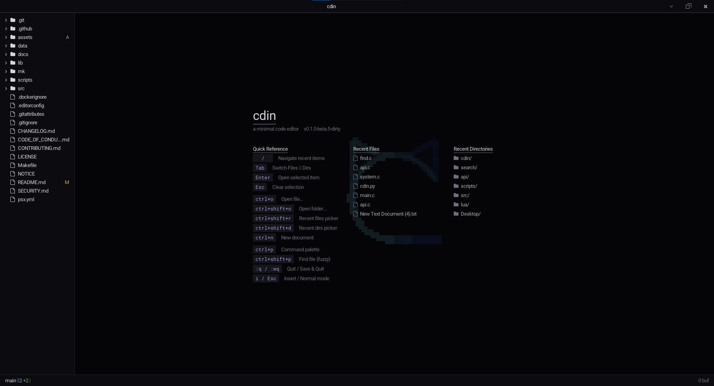
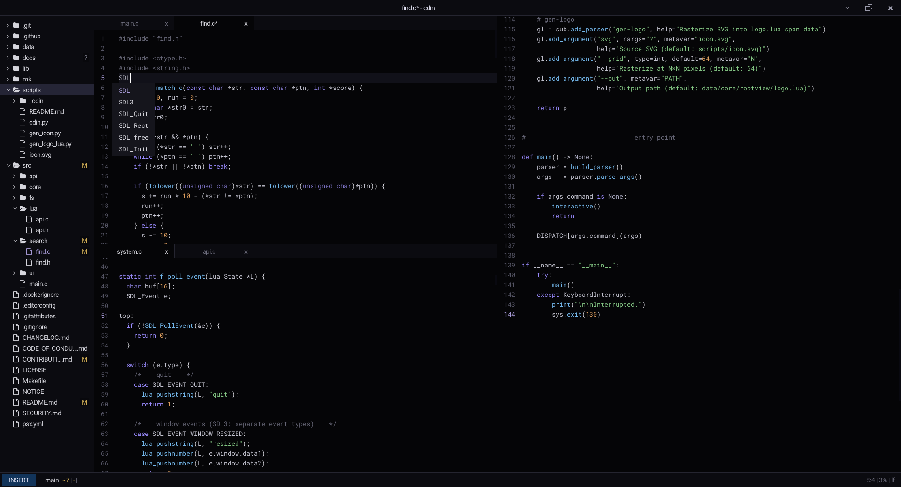

# cdin

A small, fast, keyboard-driven text editor. Vim-style modal editing is on by
default. The core is C; everything else is Lua you can read and change.

[](LICENSE)
[](CHANGELOG.md)

---

## What it is

cdin started as a fork of [lite](https://github.com/rxi/lite). The fork kept
what made lite interesting — a tiny C runtime, a Lua editor on top, and a
clean boundary between the two — and built from there.

The C layer handles the window, the renderer, and the SDL bindings. It doesn't
know anything about documents, keybindings, or plugins. The Lua layer, loaded
at startup from `data/`, is the actual editor. This means you can change how
almost anything works — commands, keybindings, UI behavior, syntax highlighting
— without recompiling. The binary is just a host.



Vim-style modal editing is built in and on by default. Every buffer opens in
Normal mode. The status bar always shows `[NORMAL]`, `[INSERT]`, or `[VISUAL]`
so you always know where you are. If you've used vim the basics transfer
directly. If you haven't, [Vim Keybindings](docs/guides/vim-keybindings.md)
has everything you need.

## Philosophy

The codebase is meant to be readable. You should be able to find the edit loop,
understand what it does, and change it. Functions are short. Modules are small.
There are no clever abstractions that require you to know the whole project
before touching any of it.

Features belong in plugins. The core does the minimum that every editor needs.
Anything optional is in `data/plugins/` where it can be read, copied, modified,
or replaced without touching the core. This is how lite-xl approaches things
too, and it works.

Startup time and memory use matter. The renderer only redraws what actually
changed. Background tasks are coroutines, not threads. An idle cdin draws
almost nothing and uses almost no CPU.

## Features

- Modal editing (Normal / Insert / Visual) built on the vim model
- Ex command line (`:w`, `:q`, `:e`, `:!cmd`, and more)
- Project tree with optional git status markers (A / M / D / ?)
- Multi-tab management and split panes
- Project-wide search
- Fuzzy file finder (`Ctrl+P`)
- Session restore
- Syntax highlighting for C, Lua, Markdown, Python, JavaScript, TypeScript
- Trailing whitespace trimmed on save
- Relative or absolute line numbers
- Three bundled themes; write your own in a single Lua file
- Configurable through `data/user/init.lua` — plain Lua, no DSL

## Quick start

```sh
git clone https://github.com/m-mdy-m/cdin.git
cd cdin

# build (requires gcc, make, SDL3, Lua 5.4)
make

# run in the current directory
./build/linux-release/cdin .

# or open a file
./build/linux-release/cdin path/to/file.c
```

See [Building from Source](docs/guides/building.md) for dependencies and
platform-specific notes. There's also a Python script if you prefer not to
use make directly:

```sh
python3 scripts/cdin.py build-install
```

## Documentation

- [Getting Started](docs/guides/getting-started.md) — the screen, modal
  editing, essential keys, where things live
- [Building from Source](docs/guides/building.md) — dependencies, make
  targets, install, Windows
- [Configuration](docs/guides/configuration.md) — every config option,
  keybindings, themes, project-local config
- [Vim Keybindings](docs/guides/vim-keybindings.md) — modes, motions,
  operators, ex commands, the `m` action menu
- [Themes](docs/guides/themes.md) — bundled themes, writing your own,
  the full style table
- [Plugins](docs/guides/plugins.md) — bundled plugins, writing your own,
  the plugin API
- [Command Reference](docs/guides/commands.md) — every command and its
  default binding
- [Troubleshooting](docs/guides/troubleshooting.md) — common problems
  and how to fix them
- [Architecture Overview](docs/architecture/overview.md) — the C/Lua
  split, the frame loop, how commands and plugins work
- [Contributing](CONTRIBUTING.md)

## Scripts

All build, install, and asset tasks go through one entry point:

```sh
python3 scripts/cdin.py [command]
```

| Command | Does |
|---|---|
| `build` | Compile from source |
| `install` | Install binary + data + desktop integration |
| `build-install` | Build then install in one step |
| `update` | Download the latest release from GitHub |
| `uninstall` | Remove an installation |
| `gen-icon` | Regenerate icons from `scripts/icon.svg` |
| `gen-logo` | Regenerate `data/core/rootview/logo.lua` |

Run with no arguments for an interactive wizard. Full documentation is in
[`scripts/README.md`](scripts/README.md).

## License

MIT — see [LICENSE](LICENSE).

## Credits

- Based on [lite](https://github.com/rxi/lite) by rxi
- Inspired by [Vim](https://www.vim.org/) and [lite-xl](https://lite-xl.com/)
- Font rendering via [stb_truetype](https://github.com/nothings/stb)