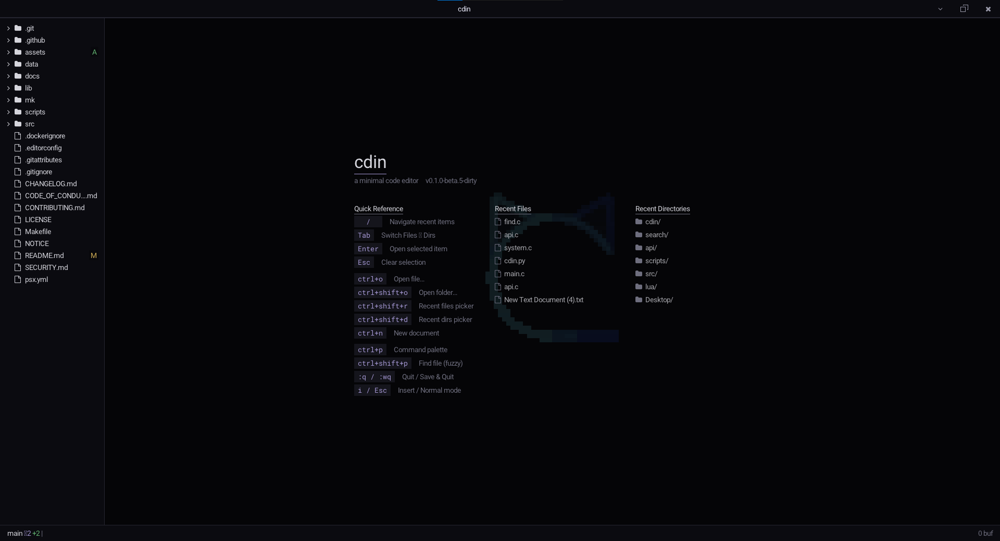
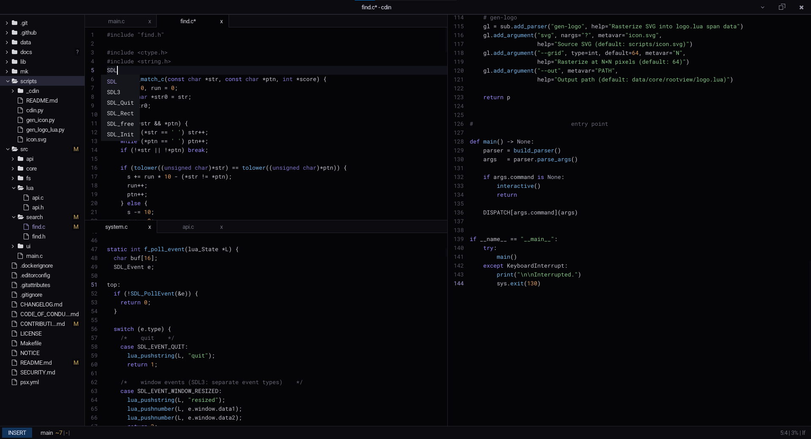

# cdin

A small, fast, keyboard-driven text editor. Vim-style modal editing is on by
default. The core is C; everything else is Lua you can read and change.

[](LICENSE)
[](CHANGELOG.md)

---

## What it is

cdin started as a fork of [lite](https://github.com/rxi/lite). The fork kept
what made lite interesting — a tiny C runtime, a Lua editor on top, and a
clean boundary between the two — and built from there.

The C layer handles the window, the renderer, and the SDL bindings. It doesn't
know anything about documents, keybindings, or plugins. The Lua layer, loaded
at startup from `data/`, is the actual editor. This means you can change how
almost anything works — commands, keybindings, UI behavior, syntax highlighting
— without recompiling. The binary is just a host.



Vim-style modal editing is built in and on by default. Every buffer opens in
Normal mode, and a coloured pill in the status bar shows which mode you are in.
If you've used vim the basics transfer directly. The full key set is documented in
[cdin-x](https://github.com/m-mdy-m/cdin-x/blob/main/docs/plugins/vim.md), where
the plugin lives; [Vim mode](docs/guides/vim-keybindings.md) covers the half this
repository owns.

## Philosophy

The codebase is meant to be readable. You should be able to find the edit loop,
understand what it does, and change it. Functions are short. Modules are small.
There are no clever abstractions that require you to know the whole project
before touching any of it.

Features belong in plugins. The core does the minimum that every editor needs.
Anything optional is an extension, read and written in its own repository
([cdin-x](https://github.com/m-mdy-m/cdin-x)) and installed into your own
site directory, so none of it needs the core to change.

Startup time and memory use matter. The renderer only redraws what actually
changed. Background tasks are coroutines, not threads. An idle cdin draws
almost nothing and uses almost no CPU.

## Features

A build is not feature-equivalent to a full install. This is what ships in the
mandatory bundle, and it is enough to be a usable editor:

- Modal editing (Normal / Insert / Visual) built on the vim model
- Ex command line (`:w`, `:q`, `:e`, `:new`, `:cd`, `:!cmd`, and more)
- Syntax highlighting
- A default theme
- File creation and editing

These come from [cdin-x](https://github.com/m-mdy-m/cdin-x) and are optional:

- Project tree with git status markers
- Multi-tab management and split panes
- Project-wide search, autocomplete, session restore
- The command palette (`Ctrl+Shift+P`), fuzzy file finder (`Ctrl+P`) and the
  open-file / open-folder prompts (`Ctrl+O`, `Ctrl+Shift+O`)
- Themes beyond the default one

Install them with `make link` in a cdin-x checkout. Without them the editor is
a plain text editor with vim keys — deliberately usable, not crippled, and no
keystroke does nothing. The mechanisms those workflows are built on
(`core.command_view`, the command and keymap registries, the project scanner)
are part of the runtime and are always there.

Configurable through your own `init.lua` — plain Lua, no DSL.

## Quick start

**`make` needs a cdin-x checkout**, because the mandatory set a runnable editor
requires — vim mode, the default theme, the fonts — lives there.

```sh
git clone https://github.com/m-mdy-m/cdin-x    # a sibling of cdin
git clone https://github.com/m-mdy-m/cdin
cd cdin

# build (requires gcc, make, SDL3, Lua 5.4)
make

# run in the current directory
./build/linux-release/cdin .

# or open a file
./build/linux-release/cdin path/to/file.c
```

`make bin` compiles the binary alone and needs no cdin-x — that is the target to
use when you are only touching C.

See [Building from Source](docs/guides/building.md) for dependencies and
platform-specific notes. There's also a Python script if you prefer not to
use make directly:

```sh
python3 scripts/cdin.py build-install
```

## Documentation

Start at [docs/](docs/README.md) — it has the reading order.

**Using it**

- [Getting Started](docs/guides/getting-started.md) — running it, the first
  screen, what a build includes and what you have to add
- [Command Reference](docs/guides/commands.md) — every command the runtime
  registers and every key it binds
- [Configuration](docs/guides/configuration.md) — every `config` key, and the
  one that decides where your plugins live
- [Themes](docs/guides/themes.md) — every colour, and writing your own
- [Syntax Highlighting](docs/guides/syntax.md) — how a language gets coloured,
  and writing a definition
- [Troubleshooting](docs/guides/troubleshooting.md) — build and runtime failures

**Making things**

- [Building from Source](docs/guides/building.md) — dependencies, make targets,
  `CDINX_DIR`, the test suites
- [Plugins](docs/guides/plugins.md) — the loader, the site directory, and
  writing one
- [Contributing](CONTRIBUTING.md)

**Working on the editor**

- [Architecture Overview](docs/architecture/overview.md) — the C/Lua split, the
  boot order, the frame loop
- [Internals](docs/architecture/internals.md) — the text pipeline, the document,
  the highlighter
- [Extension Contract](docs/architecture/extension-contract.md) — the whole of
  what cdin guarantees an extension

**Extensions themselves** — the command palette, find file, the project tree,
tabs, search, git, the themes, and vim mode — are documented in
[cdin-x](https://github.com/m-mdy-m/cdin-x), which is where the code for them
lives.

## Scripts

All build, install, and asset tasks go through one entry point:

```sh
python3 scripts/cdin.py [command]
```

| Command | Does |
|---|---|
| `build` | Compile from source |
| `install` | Install binary + data + desktop integration |
| `build-install` | Build then install in one step |
| `update` | Download the latest release from GitHub |
| `uninstall` | Remove an installation |
| `gen-icon` | Regenerate icons from `scripts/icon.svg` |
| `gen-logo` | Regenerate `data/core/rootview/logo.lua` |

Run with no arguments for an interactive wizard. Full documentation is in
[`scripts/README.md`](scripts/README.md).

## License

MIT — see [LICENSE](LICENSE).

## Credits

- Based on [lite](https://github.com/rxi/lite) by rxi
- Inspired by [Vim](https://www.vim.org/) and [lite-xl](https://lite-xl.com/)
- Font rendering via [stb_truetype](https://github.com/nothings/stb)